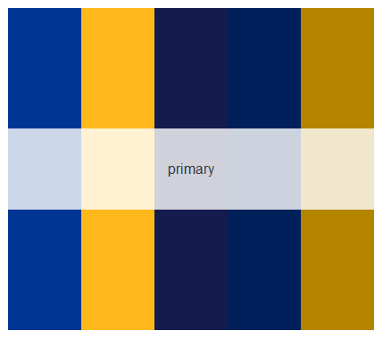
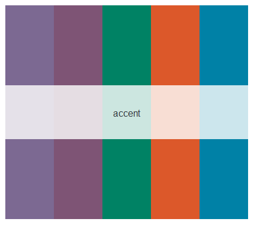

# pittpalette
Contains code for R package with R color palettes inspired by Carnegie Mellon University.
Code adopted from the lovely `inauguration` R package by Cianna Bedford-Petersen, available [here](https://github.com/ciannabp/inauguration). 

# R package installation
Install the  `pittpalette` R package using the following code:
``` r
#install.packages("devtools")
devtools::install_github("kimberlywebb/pittpalette", ref="main")
library(pittpalette)
```

# Using the pittpalette package
Use the `names` function to view the available color palettes.
```r
names(pitt_palettes)
# [1] "primary_contemporary" "primary_legacy"     "primary"           "secondary"           
# [5] "accent_rich"          "accent_vibrant"     "accent"   
```

Call the palette using the `render_pitt_palette` function
```r
render_pitt_palette("primary")
```


View a subset of the accent color scheme
```r
render_pitt_palette("accent", 5)
```


Use colors from `carnegie_palettes` in your graphs
```r
set.seed(1)
hist(rnorm(n = 100, mean = 0, sd = 1), col = pitt_palettes[["primary_contemporary"]][1])
```

